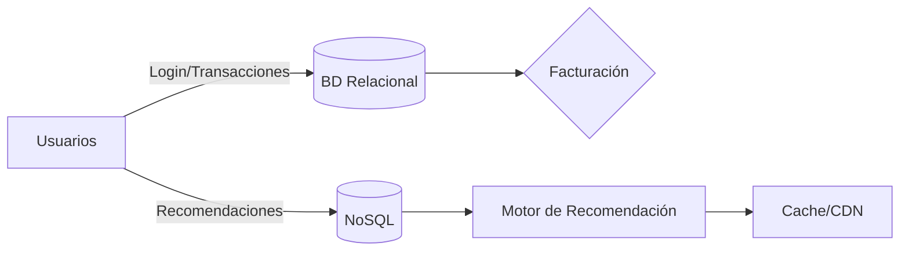

# Apuntes: Introducción y Arquitectura de Bases de Datos

[⬆ Volver al índice](#índice)

---

## Índice
- [Exámenes](#exámenes)
- [Introducción y Arquitectura de Bases de Datos](#introducción-y-arquitectura-de-bases-de-datos)
  - [BD, SGBD](#bd-sgbd)
  - [Ventajas e inconvenientes](#ventajas-e-inconvenientes)
  - [Ejemplo práctico: Netflix](#ejemplo-práctico-netflix)
- [Tips y herramientas](#tips-y-herramientas)
- [SQL y PostgreSQL](#sql-y-postgresql)
- [IA y Ciberseguridad — resumen y enlaces](#ia-y-ciberseguridad--resumen-y-enlaces)
- [Cómo colaborar en este repositorio](#cómo-colaborar-en-este-repositorio)

---

## EXÁMENES

<strong>Tipo test (pulsa para ver)</strong>

- Para optar a la **evaluación continua**, hay que aprobar (mínimo **5**).
- Al final de cada unidad se harán test de práctica (~20–30 preguntas).
- **Ojo:** las preguntas del examen final **no serán iguales** a las de los test de práctica. **A estudiar bien.**

---

## INTRODUCCIÓN Y ARQUITECTURA DE BASES DE DATOS

### BD, SGBD
- **Base de datos (BD):** conjunto organizado de información almacenada de forma estructurada para facilitar consultas y gestión eficiente.
- **SGBD:** software para crear, administrar y manipular BDs (ej.: MySQL, Oracle, PostgreSQL, SQL Server).

### Ventajas
- Integridad de los datos.  
- Seguridad y control de accesos.  
- Escalabilidad.  
- Acceso concurrente.

### Inconvenientes
- Coste (licencias, infra).  
- Complejidad en administración y mantenimiento.

### Ejemplo práctico: Netflix
- **Relacional:** transacciones (facturación, cuentas).  
- **NoSQL:** recomendaciones a gran escala.  
- **Almacenamiento distribuido:** alta disponibilidad y baja latencia.

## TIPS Y HERRAMIENTAS

- 💡 **Diferencia SQL vs NoSQL:** saber cuándo usar cada una.  
- 💡 **Instala MySQL Workbench** para practicar visualmente.  
- 💡 **Ejemplos cotidianos:** agenda, biblioteca — para entender tablas y relaciones.  
- 💡 **Comandos básicos para practicar:** `CREATE TABLE`, `INSERT`, `SELECT`, `JOIN`, `UPDATE`, `DELETE`.

**Enlaces útiles**
- [PostgreSQL](https://www.postgresql.org/)  
- [MySQL Workbench](https://www.mysql.com/products/workbench/)

---

## SQL Y POSTGRESQL

### SQL
- **Structured Query Language** — crear, modificar y consultar BDs relacionales (`SELECT`, `JOIN`, `GROUP BY`, `ORDER BY`, ...).

### PostgreSQL
- **RDBMS open source** potente.  
- Soporta **JSON**, extensiones y funciones definidas por el usuario.

---

## IA Y CIBERSEGURIDAD (resumen general)

- La IA es una herramienta **útil pero no sustituye al criterio humano**.  
- Evitar subir datos sensibles a modelos públicos.  
- Formación continua en ciberseguridad — el humano suele ser el eslabón débil.

**Enlaces recomendados**
- [INCIBE](https://www.incibe.es/)  
- [El Pingüino de Mario (YouTube)](https://www.youtube.com/@ElPinguinoDeMario)
