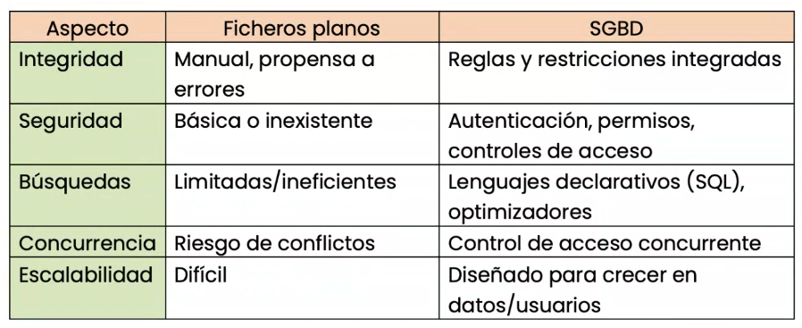
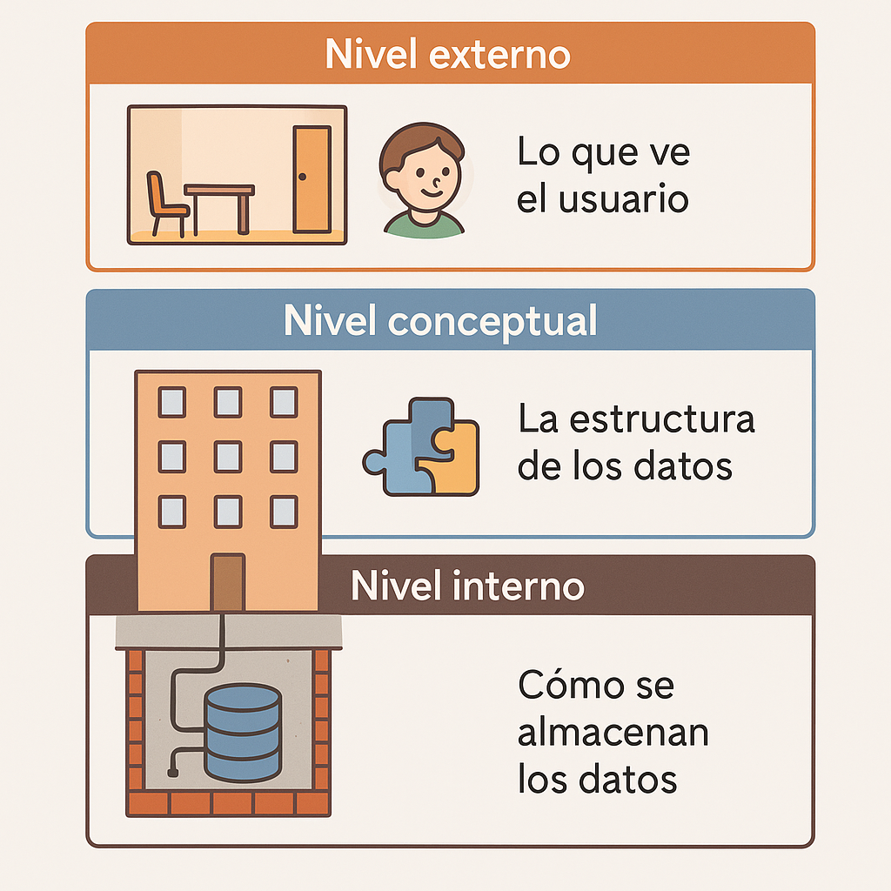
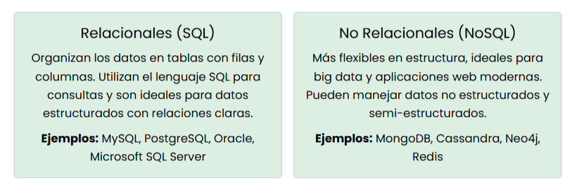
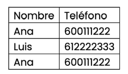

# 📝 RESUMEN DE LA CLASE DE HOY (06/10/25)

---

## 📚 Temas tratados

- Fundamentos de las bases de datos  
- Arquitectura de las bases de datos  
- Ejemplo práctico  

---

## 1️⃣ **FUNDAMENTOS DE LAS BASES DE DATOS**

---

### 📖 **Base de datos (BD)**

Conjunto organizado de información estructurada que permite **almacenar, gestionar y recuperar datos** de forma eficiente.

🌟 **Historia:**  
En los años 60, muchas organizaciones usaban **ficheros planos** (archivos de texto o binarios) para guardar datos.  
Esto provocaba:
- Duplicidad de información  
- Dificultad para búsquedas  
- Falta de seguridad  

---

### 🔑 **Conceptos clave**

- **Primary Key (Clave primaria):** campo o conjunto de campos que identifica de forma única cada registro en una tabla.  
- **SGBD (Sistema de Gestión de Bases de Datos):** software que permite crear, administrar y manipular bases de datos.  

💡 **Ejemplos:** Oracle, MySQL, PostgreSQL, Microsoft SQL Server.

---

### ⚙️ **Funciones de un SGBD**

| Función | Descripción |
|:---------|:-------------|
| **Integridad** | Garantiza consistencia y validez de los datos. |
| **Seguridad** | Control de accesos y autenticación. |
| **Escalabilidad** | Permite crecer en volumen de datos y usuarios. |
| **Acceso concurrente** | Múltiples usuarios pueden trabajar sin conflictos. |

---

### 📊 **Diferencias entre ficheros planos y SGBD**



---

### 🕰️ **Evolución histórica**

| Época | Modelo | Características | Ejemplo |
|:-------|:---------|:----------------|:----------|
| 1970–1990 | **Relacional (SQL)** | Basado en tablas y lenguaje SQL. | IBM DB2, bancos. |
| 1990–2000 | **Orientado a objetos** | Maneja datos complejos. | Videojuegos online. |
| 2010–actualidad | **NoSQL / Nube / Big Data** | Flexibles, rápidas, ideal para datos masivos. | Facebook, Twitter. |

---

## 2️⃣ **ARQUITECTURA DE BASES DE DATOS**

---

### 🧱 **Arquitectura ANSI/SPARC**

Define cómo se **organizan los datos** y cómo los usuarios o aplicaciones acceden a ellos.  
Consta de **3 niveles principales**:



| Nivel | Descripción | Ejemplo |
|:--------|:-------------|:-----------|
| **Externo** | Vista personalizada del usuario. | Alumno ve solo sus notas. |
| **Conceptual** | Modelo global de relaciones entre entidades. | Sistema con alumnos, profesores y asignaturas. |
| **Interno** | Almacenamiento físico. | Servidor donde se guardan los datos. |

---

### 🧩 **Modelo cliente-servidor**

El **cliente** envía consultas SQL al **servidor**, el cual procesa las peticiones y responde con los resultados.  
✅ Permite acceso concurrente, mayor rendimiento y seguridad.

---

### ⚖️ **SQL vs NoSQL**



| Tipo | Características | Ejemplos |
|:------|:----------------|:-----------|
| **Relacional (SQL)** | Datos estructurados en tablas, lenguaje SQL. | MySQL, PostgreSQL, Oracle. |
| **No Relacional (NoSQL)** | Datos flexibles y semi-estructurados, ideal para Big Data. | MongoDB, Cassandra, Redis. |

---

## 3️⃣ **EJEMPLO PRÁCTICO**

---

### 📄 **Problema con ficheros planos**

Si escribimos contactos en una hoja o fichero, podemos tener duplicados y errores manuales:


---

### 🧠 **Solución con una base de datos SQL**

Creamos una tabla en SQL con una clave primaria (`id`) para evitar duplicados:



```sql
CREATE TABLE Contactos (
  id INT AUTO_INCREMENT PRIMARY KEY,
  nombre VARCHAR(50),
  telefono VARCHAR(15)
);
