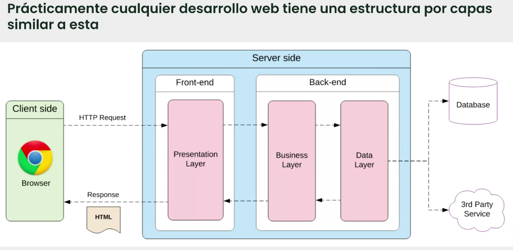

# 📝 RESUMEN DE LA CLASE DE HOY

---

## 1️⃣ **PRIMERA PARTE: INTERNET**

---

### 🌐 **Cómo funciona una página web (visión general)**

Internet usa una **arquitectura cliente-servidor**:

- El **cliente** (navegador o aplicación) realiza **peticiones (HTTP Request)** al **servidor** usando protocolos como **HTTP**.  
- El **servidor** (local o en Internet) procesa la solicitud y devuelve una **respuesta (Response)**.  
- El **navegador interpreta la respuesta** en formatos como **HTML**, **CSS** o **JavaScript** para mostrar la página al usuario.

#### 📊 Estructura típica por capas:

---

### 🌍 **Cómo funcionan los DNS**

#### 🧠 Definición
El **DNS (Domain Name System)** permite comunicarnos con dispositivos en Internet **sin recordar direcciones IP** numéricas.  
Ejemplo: en lugar de `104.26.10.229`, escribimos **webaleatoria.com**.

---

#### 🏗️ Jerarquía de dominios

##### **TLD (Top-Level Domain)**
Parte más a la derecha del dominio: en `webaleatoria.com`, sería `.com`.

Tipos:
- **gTLD (generic TLD):** indica propósito (.com → comercial, .gov → gubernamental, .org → organización…)
- **ccTLD (country code TLD):** indica país (.es → España, .ca → Canadá…)

##### **SLD (Second-Level Domain)**
En `webaleatoria.com`, el **SLD** es `webaleatoria`.  
Puede tener hasta 63 caracteres y usar solo `a-z`, `0-9` y guiones (sin empezar ni repetir guiones consecutivos).

##### **Subdominio**
Elemento a la izquierda del SLD: `admin.webaleatoria.com`.  
Tiene las mismas limitaciones de caracteres que el SLD y puedes usar múltiples subdominios.

---

### 🔁 **Repaso de conceptos de la clase anterior**

#### ☁️ SaaS (Software as a Service)
Aplicaciones listas para usar que se ejecutan en la nube.  
Ejemplos: **Salesforce, Zoom, Slack.**

#### 🧱 PaaS (Platform as a Service)
Entorno en la nube para desarrollar, probar y desplegar aplicaciones.  
Ejemplos: **Google App Engine, Heroku, Microsoft Azure.**

#### ⚙️ IaaS (Infrastructure as a Service)
Servicio en la nube para alquilar infraestructuras (servidores, redes, almacenamiento, VMs).  
Ejemplos: **AWS, Azure, Google Cloud Compute Engine.**

---

## 2️⃣ **SEGUNDA PARTE: CLOUD**

---

### ☁️ **Características principales del Cloud**

| Característica | Descripción |
|:----------------|:-------------|
| **Autoservicio bajo demanda** | El usuario puede gestionar recursos sin intervención del proveedor. |
| **Accesible a través de la red** | Los recursos están disponibles mediante Internet. |
| **Agrupación de recursos** | Los recursos del proveedor se comparten entre múltiples clientes, pero aislados entre sí. |
| **Elasticidad** | La infraestructura puede crecer o reducirse según necesidad. |
| **Servicio medido y pago por uso** | Solo se paga por los recursos utilizados, con medición transparente. |
| **De CAPEX a OPEX** | Se transforman gastos fijos en variables, protegiendo la caja de la empresa. |

---

### ☁️ **Amazon Web Services (AWS)**

AWS es la **plataforma en la nube de Amazon**.  
Proporciona infraestructura bajo demanda: **computación, almacenamiento, redes, bases de datos, inteligencia artificial, análisis de datos, etc.**

Permite a empresas **escalar aplicaciones** sin mantener servidores físicos.

#### 🏢 Ejemplos de empresas que usan AWS:
| Empresa | Uso principal |
|:----------|:--------------|
| **Netflix** | Streaming global de video. |
| **Airbnb** | Reservas y análisis de datos. |
| **Spotify** | Procesamiento y distribución de música. |
| **Coca-Cola** | Campañas y análisis de clientes. |
| **NASA** | Almacenamiento y distribución de imágenes espaciales. |

---

## 3️⃣ **TERCERA PARTE: DIFERENCIAS ENTRE CAPEX Y OPEX**

---

| Concepto | CAPEX (Gasto de Capital) | OPEX (Gasto Operativo) |
|:-----------|:---------------------------|:---------------------------|
| **Definición** | Inversión inicial en infraestructura física (servidores, hardware). | Pago recurrente por servicios en la nube (uso bajo demanda). |
| **Tipo de gasto** | Fijo / alto al inicio. | Variable / pago por uso. |
| **Ejemplo** | Comprar tus propios servidores. | Pagar a AWS solo por los recursos que usas. |
| **Ventaja** | Control total del hardware. | Flexibilidad, escalabilidad y reducción de costes iniciales. |

---

💡 **En resumen:**  
- **CAPEX:** compras y mantienes tus servidores.  
- **OPEX:** pagas solo por lo que usas en la nube.

---

## 📚 **RECURSOS Y ENLACES DE INTERÉS**

- 🌐 [Amazon Web Services (AWS)](https://aws.amazon.com/es/)  
- 🎥 [Qué es DNS y cómo funciona (YouTube)](https://www.youtube.com/watch?v=NiQTs9DbtW4)  
- 📘 [AWS - Página oficial (Amazon Web Services, Inc.)](https://aws.amazon.com/es/)

---
