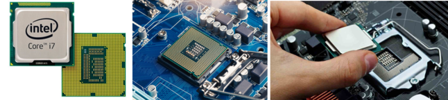
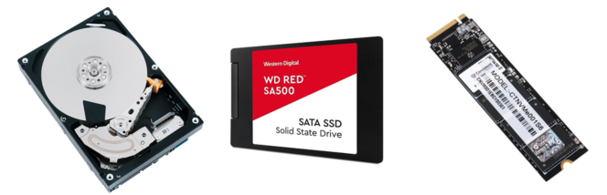
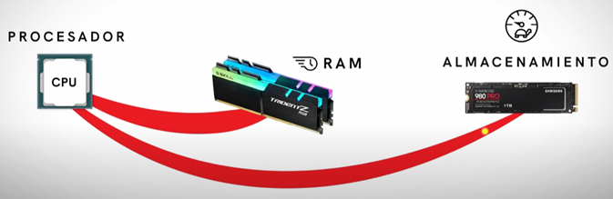
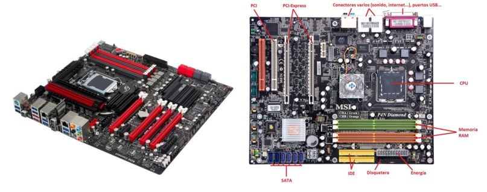
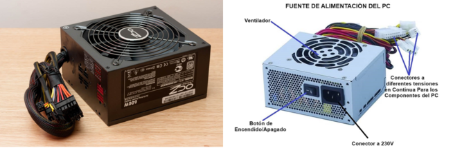
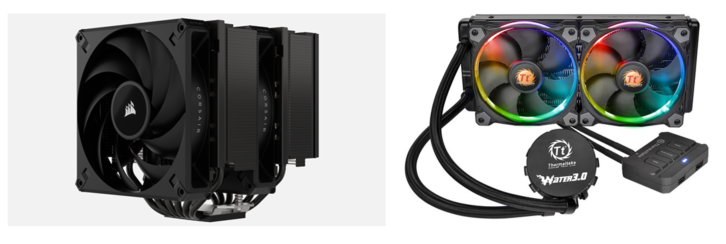
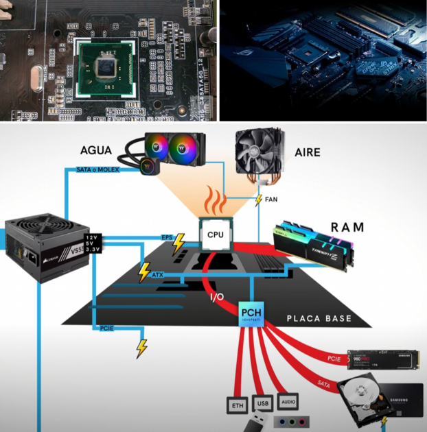
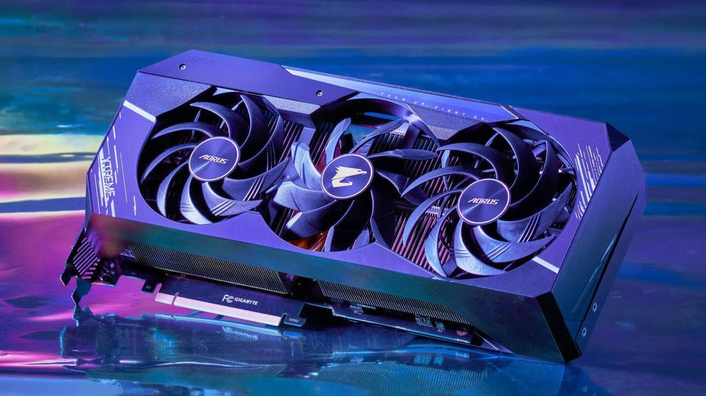

# 🧠 PARA ENTENDER MEJOR LA CLASE DEL LUNES 06/10/25

---

## 📘 Temas tratados

- Componentes básicos de tu computadora  
- Arquitectura de Von Neumann  
- Jerarquía de memoria  

---

## 1️⃣ COMPONENTES BÁSICOS DE TU COMPUTADORA

---

### 🟣 EL PROCESADOR (CPU)

El **procesador (CPU)** es el componente principal de la computadora.  
Ejecuta instrucciones y realiza cálculos para que el sistema funcione: es el **cerebro 🧠** del equipo.  
Interpreta datos de los programas y coordina el funcionamiento del resto de los componentes.

➡️ El procesador se encuentra **montado en la placa base** o tarjeta madre.  

**Ejemplos:**  
Intel Core i3, i5, i7, i9 • AMD Ryzen 3, 5, 7, 9 • Apple M1, M2, M3  

---

### 🟣 UNIDAD DE ALMACENAMIENTO

Es el dispositivo físico donde se guardan los datos del ordenador.  
Permite **leer, escribir y acceder** a la información de forma rápida y segura.

Tipos principales:

- 💾 **HDD (Disco duro):** discos magnéticos tradicionales, más lentos.  
- ⚡ **SSD (Unidad de estado sólido):** más rápida, silenciosa y resistente.  
- 🚀 **Disco M.2:** tipo de SSD moderno con conector M.2, aún más veloz y eficiente.

➡️ El procesador solicita datos al almacenamiento, pero acceder directamente es **lento**.  
Por eso se usa la **memoria RAM** como intermediaria rápida.

---

### 🟣 MEMORIA RAM (Random Access Memory)

Ubicada entre el procesador y el almacenamiento principal.  
Es una **memoria temporal y volátil**, que almacena datos e instrucciones que la CPU necesita mientras el equipo está en uso.

Ventajas:
- Permite trabajar con datos a gran velocidad.  
- Acelera el sistema operativo y las aplicaciones.  
- Los datos se borran al apagar el equipo.

**Ejemplos:**  
DDR4 Crucial Ballistix, DDR5 G.Skill Trident Z5, DDR5 Kingston Fury Beast.

---

### 🟣 LA PLACA BASE O TARJETA MADRE

Es el **componente central** que conecta todos los demás elementos:  
procesador, memoria RAM, almacenamiento, tarjetas gráficas, puertos USB, etc.

---

### 🟣 FUENTE DE ALIMENTACIÓN

Convierte la **corriente alterna (CA)** de la toma eléctrica en **corriente continua (CC)**,  
suministrando a cada componente el voltaje adecuado.

Funciones:
- Protege frente a picos eléctricos.  
- Distribuye energía a CPU, GPU, almacenamiento y ventiladores.

---

➡️ El procesador está hecho de **silicio**, un material semiconductor que permite realizar cálculos eléctricos complejos.  
Pero esta actividad genera **calor**, y debe **enfriarse** para evitar daños.

---

### 🟣 DISIPADOR

Dispositivo encargado de **reducir la temperatura** de componentes como la CPU o la GPU.  
Tipos:

- 🌬️ **Por aire:** con aletas metálicas y ventiladores.  
- 💧 **Por líquido:** con radiador y líquido refrigerante.

---

### 🟣 EL PCH (Platform Controller Hub)

Chip de la placa base que **gestiona la comunicación** entre la CPU y otros componentes (almacenamiento, USB, red, audio...).

Funciones principales:
- Controla los puertos de entrada/salida (USB, SATA, PCIe, audio).  
- Gestiona la comunicación con la memoria y dispositivos externos.  
- Maneja red, audio y seguridad.  

---

### 🟣 LA GPU (Tarjeta Gráfica)

La **GPU (Graphics Processing Unit)** es un procesador especializado en gráficos e imágenes.  
Permite renderizar imágenes en 2D/3D, procesar vídeo y realizar tareas de IA y aprendizaje automático.

➡️ El procesador (CPU) se encarga de cálculos generales,  
pero la **GPU se especializa en los gráficos**, mejorando el rendimiento visual.

---

## 🧠 RESUMEN RÁPIDO

| Componente | Función principal |
|:------------|:------------------|
| **CPU** | Procesa instrucciones y coordina todo el sistema. |
| **RAM** | Memoria temporal para operaciones rápidas. |
| **Almacenamiento (HDD/SSD)** | Guarda datos de forma permanente. |
| **Placa base** | Conecta todos los componentes. |
| **Fuente de alimentación** | Suministra energía estable. |
| **Disipador** | Evita el sobrecalentamiento. |
| **GPU** | Procesa gráficos e imágenes. |
| **PCH** | Controla la comunicación entre CPU y periféricos. |

---

