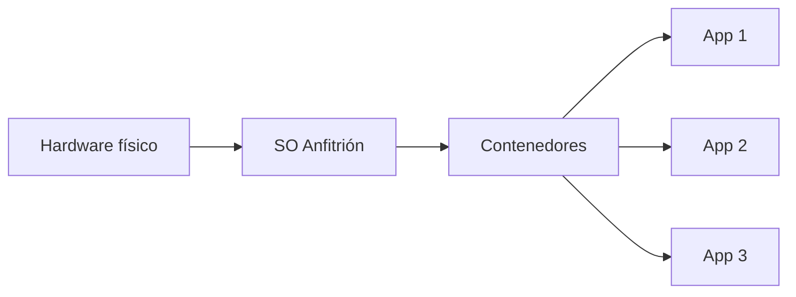

# 💻 APUNTES: SISTEMAS OPERATIVOS, VIRTUALIZACIÓN E INSTALACIONES

---

## 📘 ÍNDICE

1. [Primera parte: Resumen teoría](#1️⃣-primera-parte-resumen-teoría)  
   - [SO, Kernel y Licencias](#a-so-kernel-y-licencias)
   - [Modelos de Virtualización](#b-modelos-de-virtualización)
2. [Segunda parte: Instalaciones](#2️⃣-segunda-parte-instalaciones)  
   - [Instalación de VirtualBox](#a-instalación-de-virtualbox)
   - [Instalación de Ubuntu](#b-instalación-de-ubuntu)
3. [Tercera parte: Extras](#3️⃣-tercera-parte-extras)
4. [Enlace del profesor](#🌟enlace-en-github-del-profe-para-la-clase-de-hoy🌟)

---

## 1️⃣ **PRIMERA PARTE: RESUMEN TEORÍA**

---

### **A) SO, KERNEL Y LICENCIAS**

- **Sistema Operativo (SO):** programa o conjunto de programas que permite una comunicación simple y sencilla entre hardware y usuario.  
- **Kernel:** núcleo central del sistema operativo. Las aplicaciones se comunican con él mediante **llamadas al sistema**.  
- **Licencias de Software:** definen cómo se puede usar y distribuir un programa, distinguiendo entre software propietario y código abierto.

💻 **Comandos útiles**
```bash
uname          # Muestra la versión del núcleo (kernel)
uname -a       # Proporciona más información (versión completa)
touch archivo2 # Crea un archivo nuevo llamado "archivo2"
strace touch archivo4 # Muestra las llamadas al sistema al ejecutar 'touch archivo4'
```

## **B) MODELOS DE VIRTUALIZACIÓN**

- **Virtualización:** tecnología que permite crear versiones virtuales de recursos informáticos (sistemas operativos, servidores, almacenamiento, etc.).  
  Permite ejecutar **múltiples sistemas operativos (VMs)** en un único equipo físico gracias a un componente clave: el **hipervisor**.

---

### 🧠 **Hipervisor**

El **hipervisor** gestiona y reparte los recursos del hardware físico (CPU, RAM, disco, red) entre las máquinas virtuales.

Existen dos tipos principales:

---

### ⚙️ **Hipervisor tipo 1**
- Se instala **directamente sobre el hardware**.  
- No necesita Windows ni Linux debajo.  
- Mayor **rendimiento y seguridad**.  
- Usado sobre todo en entornos empresariales.  
- **Ejemplos:** VMware ESXi, Hyper-V Server.

> 💬 Piensa que es como si el hipervisor fuera el propio sistema operativo del ordenador.

---

### 🧩 **Hipervisor tipo 2**
- Requiere un **sistema operativo anfitrión** (Windows, Linux, macOS).  
- Funciona como una aplicación más.  
- Más fácil de usar, pero algo más lento.  
- **Ejemplos:** VirtualBox, VMware Workstation.

> 💬 Es como instalar Word o WhatsApp, pero en lugar de eso instalas un programa para crear máquinas virtuales.

---

📌 **En resumen:**

| Tipo | Dónde se instala | Velocidad | Uso típico | Ejemplos |
|:----:|:-----------------|:-----------|:------------|:-----------|
| 1️⃣ | Directamente en el hardware | Rápido | Profesional / Servidores | VMware ESXi, Hyper-V Server |
| 2️⃣ | Dentro de un sistema operativo | Más lento | Uso personal / Educación | VirtualBox, VMware Workstation |

---

### 🧙‍♂️ **Contenedores (nivel avanzado)**

Los **contenedores** son una evolución de la virtualización.  
A diferencia de las VMs, **no virtualizan el hardware**, sino el **sistema operativo**.

- Todos los contenedores **comparten el mismo kernel** del anfitrión.  
- Cada contenedor tiene su propio **espacio de usuario aislado**.  
- Son extremadamente **ligeros y rápidos**.  
- **Ejemplo:** Docker, Kubernetes.



## 2️⃣ **SEGUNDA PARTE: INSTALACIONES**

---

### **A) INSTALACIÓN DE VIRTUALBOX**

1. Ir a la web oficial → [https://www.virtualbox.org/](https://www.virtualbox.org/)
2. Pulsar el botón **Download**.
3. En “VirtualBox Platform Packages”, seleccionar el instalador según tu sistema operativo.
4. Descargar el archivo `.exe` (Windows) o `.dmg` (macOS).
5. Ejecutar el instalador → *Siguiente > Aceptar > Instalar > Finalizar*. 🎉

---

❓ **Problemas comunes**

- *Error: falta Microsoft Visual C++...*  
  👉 Instala o actualiza Visual C++ desde [este enlace oficial](https://learn.microsoft.com/es-es/cpp/windows/latest-supported-vc-redist?view=msvc-170)

---

### **B) INSTALACIÓN DE UBUNTU EN VIRTUALBOX**

1. Abre VirtualBox y pulsa **New** / **Nueva máquina**.  
2. Asigna nombre, ubicación y selecciona **Linux → Ubuntu (64-bit)**.  
3. Define usuario y contraseña.  
4. Asigna **memoria RAM (ej. 2048 MB)** y **núcleos de CPU (2)**.  
5. Crea un **disco virtual (10–20 GB)**.  
6. Descarga la **imagen ISO** desde [https://ubuntu.com/download/server](https://ubuntu.com/download/server).  
   - Archivo: `ubuntu-24.04.3-live-server-amd64.iso`
7. En VirtualBox → Configuración → **Almacenamiento → Controlador → Vacío**  
   - En “Optical Drive”, elige el icono de disco → *Choose a Disk File...*  
   - Selecciona la ISO descargada.
8. Guarda los cambios y **Inicia la máquina**.

---

❓ **Si no arranca la VM:**

- Revisa **Configuración → Sistema → Placa base → Boot Device Order**.  
  Asegúrate de poner **“Óptica” en primer lugar**.  
- Si está bloqueado, **desactiva UEFI** para poder modificar el orden de arranque.

---

✅ **Instalación de Ubuntu**

- En el arranque selecciona *Try or Install Ubuntu Server*.  
- Deja que la instalación avance.  
- Marca las opciones correctas (por ejemplo, habilitar SSH).  
- Cuando finalice, se reiniciará la VM.  
- Inicia sesión con tu usuario y contraseña. 👌

---

## 3️⃣ **TERCERA PARTE: EXTRAS**

- 🔍 Si quieres profundizar, investiga sobre **Docker** y **Kubernetes**:  
  [Guía de instalación y ejemplo con TensorFlow](https://www.jesusninoc.com/04/11/clasificacion-de-varias-imagenes-con-tensorflow-utilizando-inceptionresnetv2/)
- 🧰 Descarga de **Sysinternals Suite** (herramientas de diagnóstico avanzadas):  
  [https://learn.microsoft.com/es-es/sysinternals/downloads/](https://learn.microsoft.com/es-es/sysinternals/downloads/)
- ⚙️ Para ver cuántos núcleos tiene tu PC:  
  **Administrador de tareas → Rendimiento → CPU → Núcleos / Procesadores lógicos**  
  (ahí también puedes ver si la **virtualización** está activada).
- 🧠 Si no lo está, busca cómo **activarla desde la BIOS** (hay muchos tutoriales sencillos en YouTube).
- 💾 SSD recomendado:  
  [Western Digital NVMe SN5000](https://www.amazon.es/Western-Digital-Velocidad-Technology-migración/dp/B0D7MKQKXZ/)

---

## 🌟 **ENLACE EN GITHUB DEL PROFE PARA LA CLASE DE HOY**

📎 [Repositorio de clase (Jesús Ninoc) – 29/09/2025](https://github.com/jesusninoc/ClasesISO/blob/master/2025-09-29.md)
