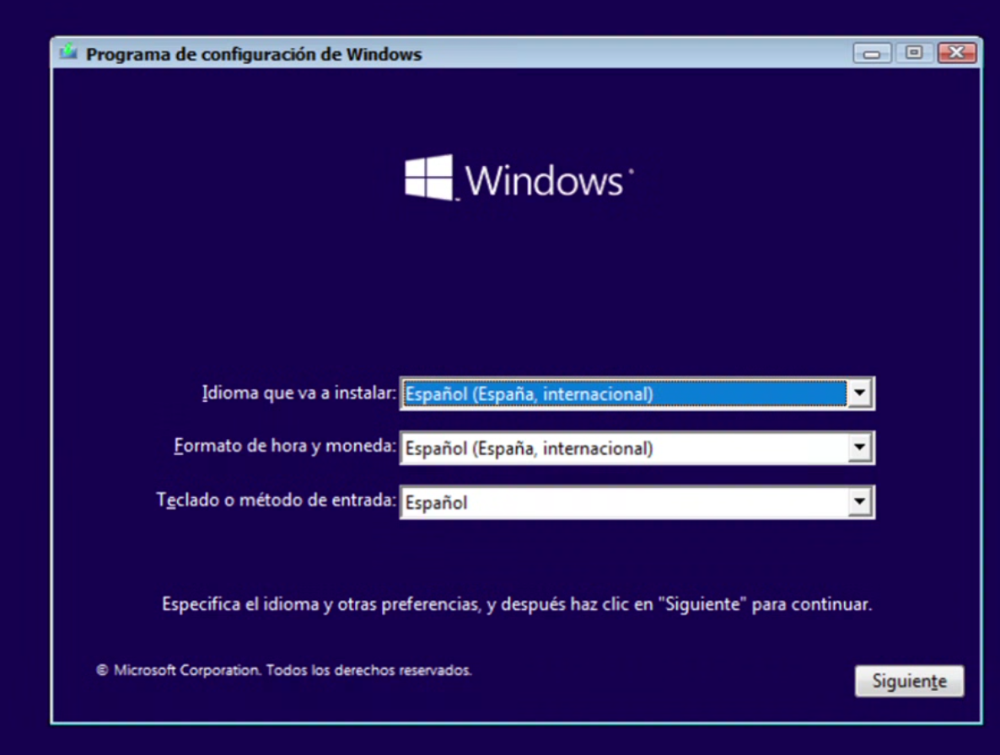

# 📝 RESUMEN DE LA CLASE DE HOY (14/10/2025)

- BIOS VS UEFI // Bootloaders: GRUB, LILO, BOOTMGR
- Acceder a tu UEFI/BIOS
- Recapitulación y nueva instalación: Windows 10 via USB
- Reto de la semana

---

## 1️⃣ Arranque del sistema

### 🔴 UEFI vs BIOS

**BIOS (Basic Input/Output System)** y **UEFI (Unified Extensible Firmware Interface)** son tipos de firmware que inician el hardware y cargan el sistema operativo.

- **BIOS →** tradicional y antiguo. Interfaz simple, discos hasta **2 TB** y arranque **MBR**. Menos rápido y seguro.
- **UEFI →** moderno (sustituye a BIOS). Soporta discos grandes y arranque **GPT**. Interfaz gráfica, arranque más rápido y **Secure Boot**.

> **Idea clave:** UEFI es la evolución del BIOS: más seguridad, más velocidad y mejor compatibilidad con hardware moderno.

### 🔴 Bootloaders

Tras BIOS/UEFI, el control pasa a un **bootloader** (cargador de arranque), cuyo trabajo es localizar y cargar el kernel del SO.

- **GRUB** (común en Linux)
- **BOOTMGR** (Windows)

### 🔴 Tipos de arranque

- **Legacy (CSM):** emula BIOS sobre UEFI. Útil para MBR o equipos antiguos.
- **Seguro (Secure Boot):** valida firmas de binarios de arranque.
- **Múltiple (multi-boot):** menú para seleccionar SO (p. ej., GRUB con Windows y Linux).

> Entender firmware, particionado (ESP/MBR) y bootloader ayuda a diagnosticar por qué un equipo arranca (o no) y cómo intervenir.

> **¿Qué es un firmware?**  
> Software básico grabado en el hardware que permite la comunicación HW/SW y que el dispositivo arranque y funcione.

---

## 2️⃣ Recapitulación y nueva instalación: Windows 10 via USB

Hasta ahora hemos instalado:

- **VirtualBox / VMware Workstation u otro**  
  - https://www.virtualbox.org/  
  - https://www.vmware.com/products/desktop-hypervisor/workstation-and-fusion
- **Ubuntu vía ISO**  
  - https://ubuntu.com/download/server
- **Windows 11 o Windows Server vía ISO**  
  - https://www.microsoft.com/es-es/software-download/windows11  
  - https://www.microsoft.com/es-mx/evalcenter/download-windows-server-2025

### 🔴 Descarga de Windows 10 en un USB

1. Entra en: https://www.microsoft.com/es-es/software-download/windows10  
   En **“Crear medios de instalación de Windows 10”**, pulsa **Descargar ahora**.
2. Descarga el `.exe` **MediaCreationTool** y ejecútalo.
3. Acepta términos → **Crear medios de instalación** → elige idioma, edición y arquitectura → **Unidad flash USB**.
4. Conecta un USB de **≥ 8 GB**, selecciónalo y pulsa **Siguiente**.
5. Espera a que termine la creación del USB. **¡Listo!** 🎉

### 🔴 Instalación de Windows via USB

Instala Windows 10 desde el USB (sobre tu máquina de Ubuntu). Deberías llegar al menos a esta pantalla:

#### ⚠️ Notas importantes

- Si no lo logras, el profesor lo explicará en la próxima clase.
- Revisa el vídeo de la clase: selecciona **solo la partición vacía**; evita borrar tu sistema.
- Necesitas un **USB físico**. Con ISO también se puede, pero ya se practicó: probad este método.

---

## 🏆 Reto de la semana

Tras instalar y arrancar **Windows Server**, desde un **arranque de recuperación**, ¿puedes cambiar la contraseña?

- 📺 Instrucciones en vídeo: https://www.youtube.com/watch?v=ynFVtiI4agc

**Si lo consigues, envía capturas al profesor.**
