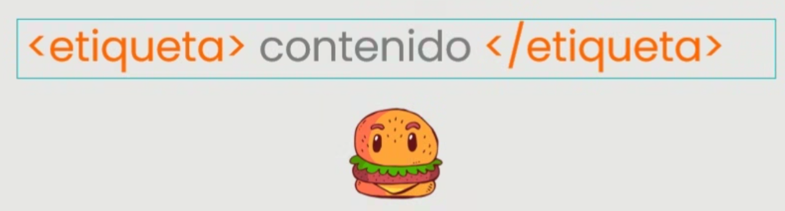
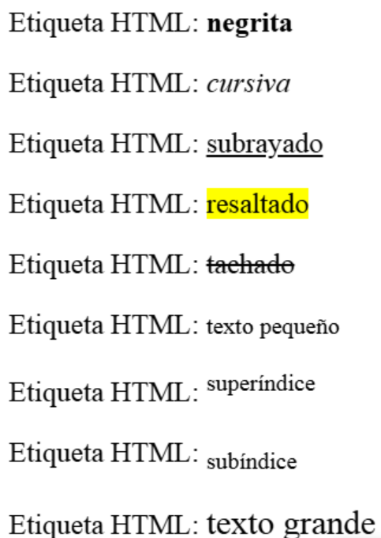
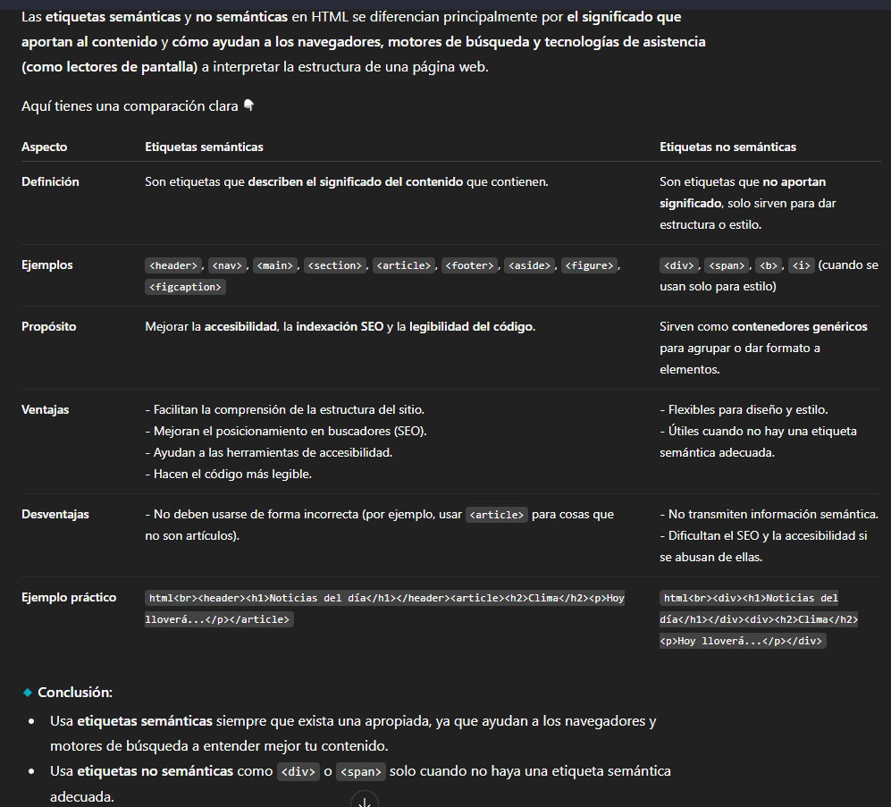
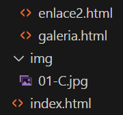
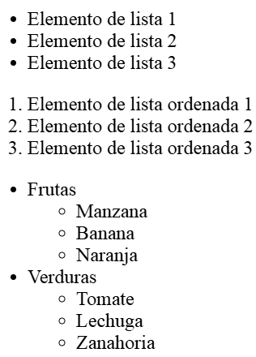

# 📝 RESUMEN DE LA CLASE DE HOY (08/10/25)

## 📘 Temas tratados

- Etiquetas HTML  
- Atributos  
- Navegar entre pestañas  
- Enlazar a distintas partes de una misma página  
- Enviar correos  
- Insertar imágenes  
- Mantener los archivos ordenados  
- Listas  
- Práctica final  

---

## 1️⃣ ETIQUETAS HTML

Las etiquetas HTML se escriben con esta estructura:



Ejemplos básicos:

```html
<a href="https://www.google.com">Visita Google</a>
<p>Este es un párrafo de ejemplo en mi página web</p>
<hr> <!-- Línea separatoria -->
<br> <!-- Salto de línea -->
```

### 🧩 Formatos de texto

```html
<p>Etiqueta HTML: <b>negrita</b></p>
<p>Etiqueta HTML: <i>cursiva</i></p>
<p>Etiqueta HTML: <u>subrayado</u></p>
<p>Etiqueta HTML: <mark>resaltado</mark></p>
<p>Etiqueta HTML: <del>tachado</del></p>
<p>Etiqueta HTML: <small>texto pequeño</small></p>
<p>Etiqueta HTML: <sup>superíndice</sup></p>
<p>Etiqueta HTML: <sub>subíndice</sub></p>
<p>Etiqueta HTML: <big>texto grande</big></p>
```



---

## 2️⃣ ATRIBUTOS

```html
<a href="https://www.google.com/">Visita Google</a>
<p id="nombre">párrafo</p>
<p id="nombre" name="nombre">párrafo</p>
```

- `href` → especifica la URL o ruta del enlace.  
- `id` → identifica un elemento de forma única.  
- `name` → identifica un elemento con un nombre.

⚠️ **Consejos importantes**

- Evita usar estilos directamente en HTML (usa CSS).  
- Mantén los archivos bien organizados (html, css, js, imágenes, etc.).  
- Usa **etiquetas semánticas** siempre que sea posible.



---

## 3️⃣ NAVEGAR ENTRE PESTAÑAS

Ejemplos de navegación entre archivos HTML:

```html
<!-- Desde index.html hacia enlace1.html -->
<a href="enlaces/enlace1.html">Ir a la página "enlace1"</a>

<!-- Desde enlace1.html hacia galeria.html -->
<a href="galeria.html">Ir a la página de galería</a>

<!-- Desde galeria.html hacia index.html -->
<a href="../index.html">Volver al índice</a>
```
(61d012fc-4d38-414b-aadc-e095cbff6442.png)  

---

## 4️⃣ ENLAZAR A DISTINTAS PARTES DE UNA PÁGINA

Ejemplo de navegación dentro de una misma página:

```html
<p id="inicio">PRINCIPIO DE LA PÁGINA</p>
...
<p id="final">FINAL DE LA PÁGINA</p>

<a href="#final">Ir al final</a>
<a href="#inicio">Volver al principio</a>
```

---

## 5️⃣ ENVIAR CORREOS

```html
<a href="mailto:olga.moreno@thepower.education">Enviar correo a Olga</a>
```

💡 *Existen métodos más avanzados (formularios + backend), pero esta es la forma básica.*

---

## 6️⃣ INSERTAR IMÁGENES

```html

```

- `src` → ruta de la imagen  
- `alt` → texto alternativo (para accesibilidad)  
- `width` → tamaño de la imagen  

📸 *El atributo `alt` mejora la accesibilidad y el SEO.*



---

## 7️⃣ LISTAS

```html
<ul>
  <li>Elemento de lista 1</li>
  <li>Elemento de lista 2</li>
  <li>Elemento de lista 3</li>
</ul>

<ol>
  <li>Elemento de lista ordenada 1</li>
  <li>Elemento de lista ordenada 2</li>
  <li>Elemento de lista ordenada 3</li>
</ol>

<ul>
  <li>Frutas
    <ul>
      <li>Manzana</li>
      <li>Banana</li>
      <li>Naranja</li>
    </ul>
  </li>
  <li>Verduras
    <ul>
      <li>Tomate</li>
      <li>Lechuga</li>
      <li>Zanahoria</li>
    </ul>
  </li>
</ul>
```



---

## 🪢 EJERCICIO DE PRÁCTICA

No es obligatorio, pero sí recomendable.  
📤 Se pueden subir capturas al Discord oficial.

🔗 [Repositorio de prácticas — Olga Moreno](https://github.com/olga3emes/proyectos)

