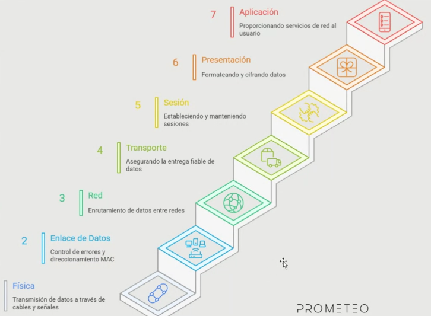
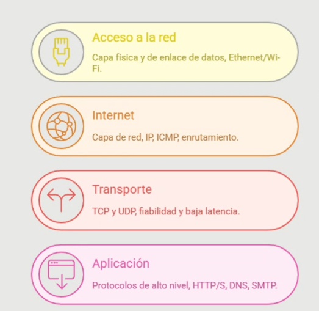
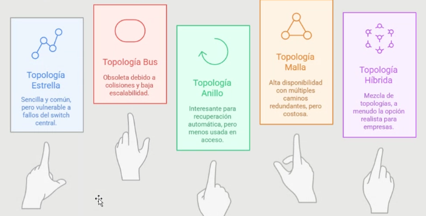
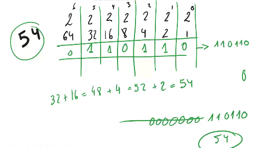
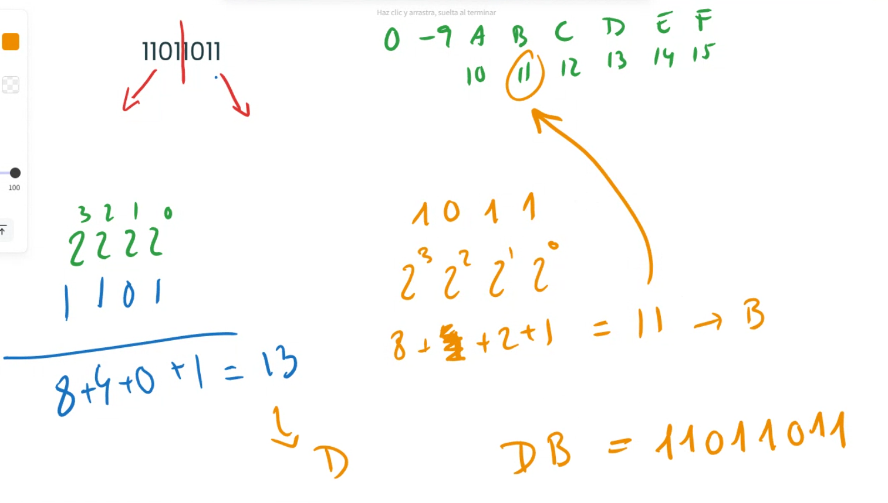
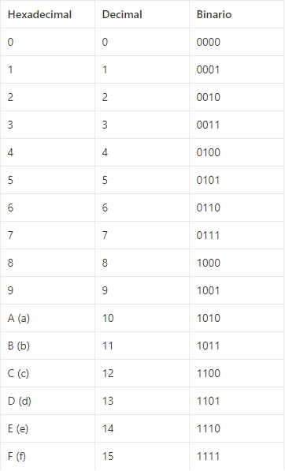

# 📝 RESUMEN DE LA CLASE DE HOY

---

## 📘 Contenidos vistos

- Modelo **OSI**
- Modelo **TCP/IP**
- **Topologías de red**
- **Binario / Decimal / Hexadecimal**

---

## 1️⃣ **PRIMERA PARTE: MODELO OSI**

El **Modelo OSI** (*Open Systems Interconnection*) es una **estructura de referencia** que divide las funciones de una red en **7 capas**, para estandarizar la comunicación entre sistemas distintos.  
Es un **modelo conceptual**, no técnico, que describe cómo los datos viajan desde un dispositivo a otro.

📊 **Capas del modelo OSI:**

| Nº | Capa | Función principal |
|:--:|:---------------------|:---------------------------------------------|
| 7 | **Aplicación** | Proporciona servicios de red al usuario final. |
| 6 | **Presentación** | Formatea y cifra datos. |
| 5 | **Sesión** | Establece y mantiene sesiones. |
| 4 | **Transporte** | Garantiza la entrega fiable de datos. |
| 3 | **Red** | Enrutamiento de datos entre redes. |
| 2 | **Enlace de datos** | Control de errores y direccionamiento MAC. |
| 1 | **Física** | Transmisión de datos mediante cables o señales. |

---

## 2️⃣ **SEGUNDA PARTE: MODELO TCP/IP**

El modelo **TCP/IP** es un marco de referencia más práctico, usado en **Internet**, que simplifica el modelo OSI dividiéndolo en **4 capas principales**:

| Capa | Descripción | Ejemplos |
|:------|:-------------|:-----------|
| **Acceso a la red** | Capa física y de enlace (Ethernet, Wi-Fi). | Controladores de red. |
| **Internet** | Capa de red, direccionamiento y enrutamiento (IP, ICMP). | IP, ICMP. |
| **Transporte** | Fiabilidad y latencia (TCP y UDP). | TCP, UDP. |
| **Aplicación** | Protocolos de alto nivel (HTTP/S, DNS, SMTP). | HTTP, HTTPS, DNS, SMTP. |

---

## 3️⃣ **TERCERA PARTE: TOPOLOGÍAS DE RED**

Una **topología de red** describe cómo se conectan físicamente o lógicamente los dispositivos entre sí.

| Topología | Descripción | Ventaja principal |
|:------------|:-------------|:-------------------|
| **Estrella** | Cada nodo se conecta a un punto central (switch o hub). | Fácil de configurar. |
| **Bus** | Todos los nodos comparten el mismo cable. | Económica, pero obsoleta. |
| **Anillo** | Cada nodo se conecta al siguiente formando un círculo. | Permite recuperación automática. |
| **Malla** | Todos los nodos se interconectan entre sí. | Alta disponibilidad, redundancia. |
| **Híbrida** | Mezcla de varias topologías. | Flexible y escalable para empresas. |

---

## 4️⃣ **CUARTA PARTE: RECORDATORIO DECIMAL / BINARIO**

La **conversión de decimal a binario** consiste en expresar un número en base 2 (solo 0 y 1).  
Cada posición representa una potencia de 2.

Ejemplo:  
54 → `110110`  
(32 + 16 + 4 + 2 = 54)

---

## 5️⃣ **QUINTA PARTE: HEXADECIMAL 🔥**

El **sistema hexadecimal** (base 16) usa números del 0 al 9 y letras de la A a la F.  
Cada **grupo de 4 bits binarios** equivale a un **dígito hexadecimal**.

Ejemplo:  
`11011011` → se divide en `1101` (13 = D) y `1011` (11 = B)  
Resultado → **DB**

---

## 📌 **ALGUNOS CONCEPTOS VISTOS HOY**

- **Cables Ethernet:** conectan dispositivos (PC, routers, switches) mediante señales eléctricas.  
- **Cables de fibra óptica:** transmiten datos por pulsos de luz, permitiendo gran velocidad y distancia.  
- **IP (Internet Protocol):** dirección única que identifica a un dispositivo en la red (IPv4 o IPv6).  
- **ICMP:** protocolo de control y diagnóstico de red (usado en *ping*).  
- **TCP:** protocolo fiable, asegura que los datos lleguen completos y ordenados.  
- **UDP:** protocolo rápido sin verificación de entrega.  
- **HTTP:** protocolo web sin cifrado.  
- **HTTPS:** versión segura de HTTP (usa SSL/TLS).  
- **DNS:** traduce nombres de dominio a direcciones IP.  
- **SMTP:** protocolo para envío de correos electrónicos.  
- **QoS (Quality of Service):** prioriza tráfico crítico (voz, vídeo).  
- **Jitter:** variación en el tiempo de entrega de paquetes.

